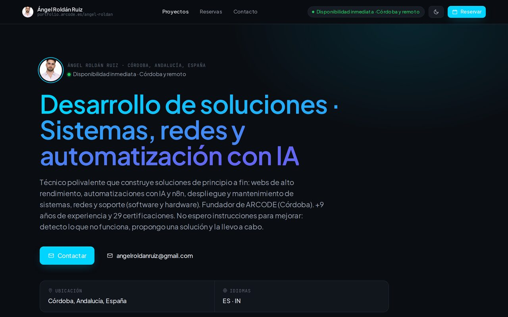
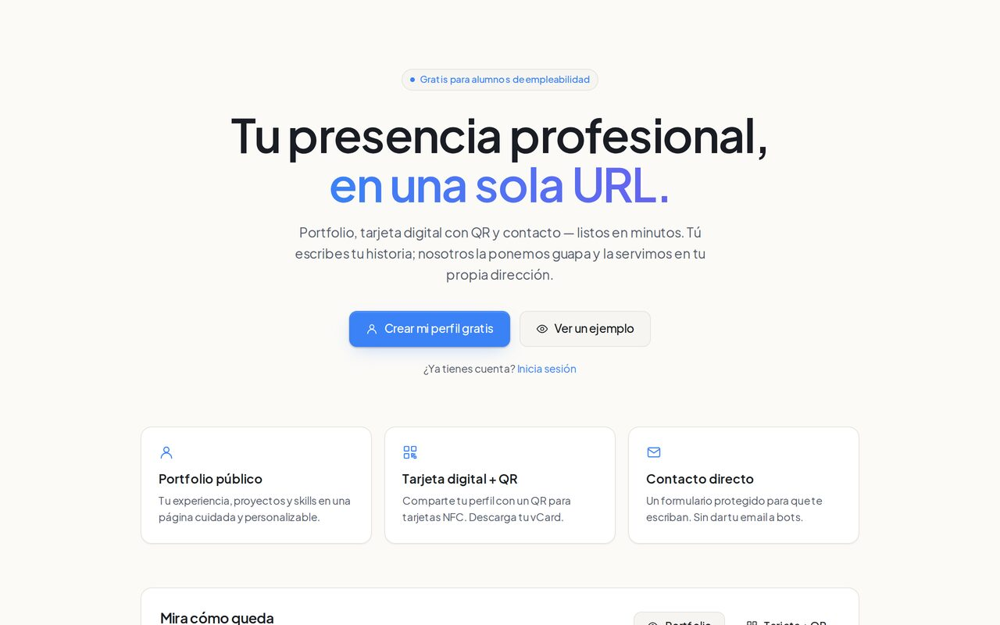
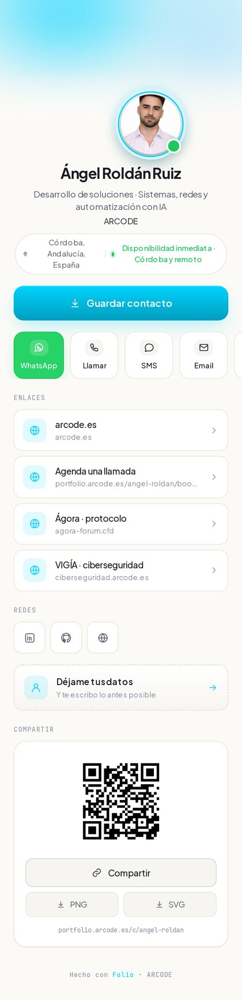

# Folio — open-source portfolio + digital card

🇬🇧 English · [🇪🇸 Español](./README.es.md)

Your professional presence in a single URL: a polished **public portfolio**, an animated **mobile-first digital card** (QR + vCard + WhatsApp), **self-managed booking**, and a protected **contact form** — fully self-hostable and customizable.

[](https://vercel.com/new/clone?repository-url=https://github.com/r10d1nsec/open-CV-Web&env=NEXT_PUBLIC_SUPABASE_URL,NEXT_PUBLIC_SUPABASE_ANON_KEY,SUPABASE_SERVICE_ROLE_KEY,NEXT_PUBLIC_SITE_URL&envDescription=Supabase%20keys%20and%20your%20public%20site%20URL)

## Screenshots



<table>
  <tr>
    <td width="62%"></td>
    <td width="38%"></td>
  </tr>
  <tr>
    <td align="center"><sub>Landing</sub></td>
    <td align="center"><sub>Digital card (mobile)</sub></td>
  </tr>
</table>

## Features

- **Public portfolio** `/<username>` — hero, skills, experience, projects (with images + links), services, testimonials, contact. Per-profile theming (accent color, font, section order/visibility).
- **Digital card** `/c/<username>` — mobile-first, animated (pure CSS), 3 styles (aurora/minimal/mesh). Save contact (vCard), **WhatsApp**, call/SMS/email, **unlimited custom links**, social grid, **QR + native share**, lead capture. All editable from the dashboard.
- **Self-managed booking** — weekly availability + bookings with owner approval (timezone Europe/Madrid by default). No external calendar/OAuth needed.
- **Dashboard** — onboarding wizard, full editor (identity, bio, social, skills, projects, testimonials, services, brand, card), leads inbox, GDPR account deletion.
- **Auth** — email/password (Supabase). Google OAuth ready behind a feature flag.
- **Extras** — vCard + QR endpoints, rate limiting (in-memory or Upstash), optional Resend email, optional Sentry.

## Tech stack

Next.js 15 (App Router, TS strict) · React 19 · Supabase (Auth/Postgres/Storage, RLS) · Tailwind + CSS design tokens · Vitest + Playwright · deploy on Vercel or any Node 22 host.

## Quickstart (local)

```bash
git clone https://github.com/r10d1nsec/open-CV-Web.git
cd open-CV-Web
pnpm install
pnpm dev                        # http://localhost:3000
```

Without Supabase configured you'll see the built-in demo profile (mock) at `/maya` and `/c/maya` — zero config. To make it real (auth + your own data), connect Supabase: see **[docs/SETUP.md](./docs/SETUP.md)**.

## Deploy

- **Vercel (recommended)**: click the button above, set the env vars, done. Full guide: **[docs/DEPLOY.md](./docs/DEPLOY.md)**.
- **Self-host**: `pnpm build && pnpm start` on Node 22. See DEPLOY.

## Customize

Theme, accent, fonts, layouts, sections, the digital card and its links — all from the dashboard or via design tokens. See **[docs/CUSTOMIZE.md](./docs/CUSTOMIZE.md)**.

## Scripts

```bash
pnpm dev | build | start
pnpm typecheck | lint | test | test:e2e
pnpm format
```

## License

MIT © 2026 Ángel Roldán Ruiz. See [LICENSE](./LICENSE). Contributions welcome — see [CONTRIBUTING.md](./CONTRIBUTING.md).
